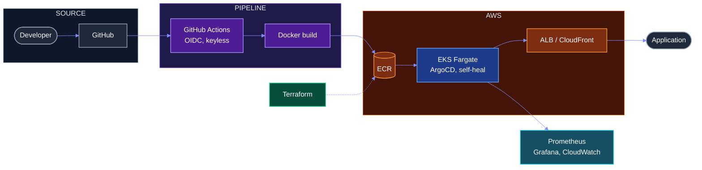
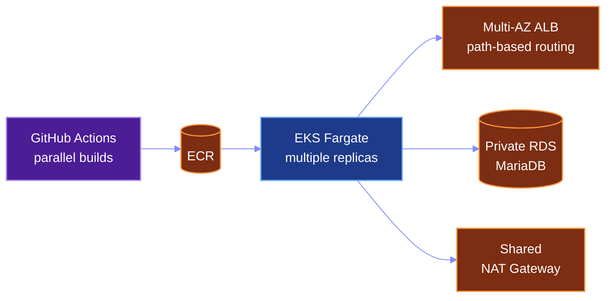
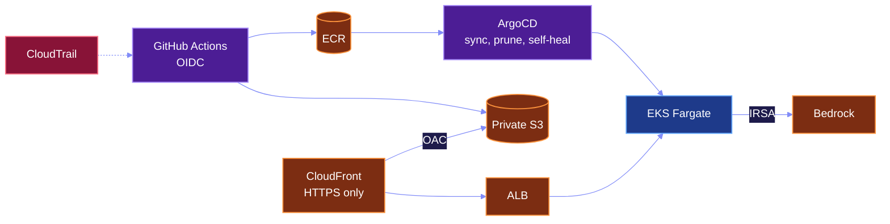

```mermaid
%%{init: {'theme':'base','themeVariables':{'fontFamily':'Inter, ui-sans-serif, system-ui, sans-serif','lineColor':'#818CF8','textColor':'#E2E8F0','edgeLabelBackground':'#1E1B4B','primaryTextColor':'#FFFFFF'}}}%%
flowchart LR
  A["OIDC"] --> B["Temporary<br/>credentials"] --> C["IRSA"] --> D["Least<br/>privilege"] --> E["Private<br/>network"] --> F["WAF"] --> G["CloudTrail"]
classDef aws fill:#7C2D12,stroke:#FB923C,color:#FFF,stroke-width:1.5px
classDef k8s fill:#1E3A8A,stroke:#60A5FA,color:#FFF,stroke-width:1.5px
classDef ci fill:#4C1D95,stroke:#A78BFA,color:#FFF,stroke-width:1.5px
classDef iac fill:#064E3B,stroke:#34D399,color:#FFF,stroke-width:1.5px
classDef obs fill:#164E63,stroke:#22D3EE,color:#FFF,stroke-width:1.5px
classDef sec fill:#881337,stroke:#FB7185,color:#FFF,stroke-width:1.5px
classDef neu fill:#1E293B,stroke:#94A3B8,color:#FFF,stroke-width:1.5px
class A,B,C,D,E,F,G sec
```

<div align="center">


<br/>


<sub><i>— Nitya Prakash</i></sub>

<br/>

### DEVOPS ENGINEER


<br/>

<a href="#projects"></a>
<a href="#stack"></a>
<a href="#architecture"></a>
<a href="#github"></a>
<a href="#contact"></a>

</div>

<br/>

```yaml
status:    operational
location:  Pune, Maharashtra, India
cloud:     AWS
compute:   [EKS, Fargate, ECS]
delivery:  [GitHub Actions, ArgoCD]
iac:       [Terraform, Ansible]
observe:   [Prometheus, Grafana, ELK]
security:  [IAM, OIDC, IRSA]
```

<br/>

<h3 align="center">
I build cloud platforms where<br/>
deployments are repeatable,<br/>
credentials are temporary,<br/>
failures are observable,<br/>
and scale is designed, not hoped for.
</h3>

<p align="center">


</p>

<br/>

<a name="stack"></a>


<br/>

<p align="center"><b><code>CLOUD · AWS</code></b><br/>
                </p>

<p align="center"><b><code>CONTAINERS</code></b><br/>
    </p>

<p align="center"><b><code>DELIVERY</code></b><br/>
   </p>

<p align="center"><b><code>INFRASTRUCTURE</code></b><br/>
     </p>

<p align="center"><b><code>OBSERVABILITY</code></b><br/>
    </p>

<p align="center"><b><code>SECURITY · NETWORKING</code></b><br/>
         </p>

<p align="center"><b><code>TOOLS</code></b><br/>
     </p>

<br/>

<a name="architecture"></a>


<br/>




<br/>

<a name="projects"></a>


<br/>

### 01 · Containerized Web Application Deployment on Amazon EKS Fargate with GitHub Actions CI/CD

> Push-to-deploy pipeline: parallel image builds, ECR push, manifest apply and rollout verification on EKS Fargate.





<p align="center"><br/></p>


- VPC prepared for Fargate: NAT Gateway and a private pod subnet
- Private RDS MariaDB, security group scoped to the VPC CIDR
- AWS Load Balancer Controller via an IRSA role limited to one service account
- Frontend and API behind one ALB with path-based routing


<p align="center">          </p>

<br/>


### 02 · Production GitOps Delivery on Amazon EKS Fargate with CloudFront and Keyless CI/CD

> Production delivery with no long-lived AWS credentials, and a cluster that corrects its own configuration drift.





<p align="center"><br/><br/></p>


- Trust policy restricted to one repository and branch
- Static build synced to private S3, served through CloudFront with OAC
- ALB as the API origin, HTTPS-only access
- Least-privilege Bedrock policy for the backend pod via IRSA


<p align="center">           </p>

<br/>


### 03 · Microservices Migration from Docker Compose to Kubernetes on Amazon EKS

> Three Spring Boot microservices and a React/Vite frontend moved from a single EC2 host to EKS.

```mermaid
%%{init: {'theme':'base','themeVariables':{'fontFamily':'Inter, ui-sans-serif, system-ui, sans-serif','lineColor':'#818CF8','textColor':'#E2E8F0','edgeLabelBackground':'#1E1B4B','primaryTextColor':'#FFFFFF'}}}%%
flowchart LR
  DC["Docker Compose<br/>single EC2 host"] --> SV["Containerized<br/>services"] --> ECR[("ECR")] --> EKS["EKS<br/>manifests, HPA"] --> ALB["ALB Ingress"] --> R53["Route 53<br/>Certbot SSL"] --> PROD(["Production"])
classDef aws fill:#7C2D12,stroke:#FB923C,color:#FFF,stroke-width:1.5px
classDef k8s fill:#1E3A8A,stroke:#60A5FA,color:#FFF,stroke-width:1.5px
classDef ci fill:#4C1D95,stroke:#A78BFA,color:#FFF,stroke-width:1.5px
classDef iac fill:#064E3B,stroke:#34D399,color:#FFF,stroke-width:1.5px
classDef obs fill:#164E63,stroke:#22D3EE,color:#FFF,stroke-width:1.5px
classDef sec fill:#881337,stroke:#FB7185,color:#FFF,stroke-width:1.5px
classDef neu fill:#1E293B,stroke:#94A3B8,color:#FFF,stroke-width:1.5px
class DC,SV neu
class ECR,ALB,R53 aws
class EKS k8s
class PROD iac
```





<p align="center"></p>


- Namespace, ConfigMap, Deployment, Service, ALB Ingress and HPA manifests
- Cluster via eksctl; Load Balancer Controller with IRSA
- NAT Gateway for a stable egress IP
- Idempotent bootstrap script that seeds organizations and users


<p align="center">          </p>

<br/>


<br/>

```diff
@@ CASE 01 · EKS FARGATE + GITHUB ACTIONS @@
- PODS STUCK IN PENDING
+ Fargate scheduling configuration
- COREDNS FAILURES
+ cluster DNS on Fargate
- IMAGEPULLBACKOFF
+ missing NAT route from the private subnet
- CRASHLOOPBACKOFF
+ RDS security-group rules
- ALB 502
+ traced through target health and logs

@@ CASE 02 · KEYLESS GITOPS ON EKS FARGATE @@
- OIDC ACCESSDENIED
+ IAM trust relationship, found in CloudTrail
- ARGOCD CRD SIZE LIMIT
+ solved with server-side apply
- ADMISSION WEBHOOK FAILURE
+ failing webhook blocking deployments
- EKS ACCESS POLICY ERRORS
+ cluster access granted explicitly
- FARGATE PROFILE IMMUTABILITY
+ profiles cannot be edited in place
- RUNASNONROOT UID ERRORS
+ container user IDs vs. the security policy

@@ CASE 03 · DOCKER COMPOSE TO EKS @@
- HOSTNAME MISMATCHES
+ configuration defects found during cutover
```

<br/>


<br/>




<br/>


<br/>


<br/>


<br/>

<p align="center">


</p>

<br/>

<a name="github"></a>


<br/>

<p align="center">

</p>

<p align="center">


</p>

<br/>

<a name="contact"></a>

<div align="center">

## Let’s talk infrastructure.

<a href="https://linkedin.com/in/rohit-m-934a66222"></a>
<a href="https://github.com/Rohit-1920"></a>
<a href="mailto:mahajanrohit759@gmail.com"></a>


</div>
