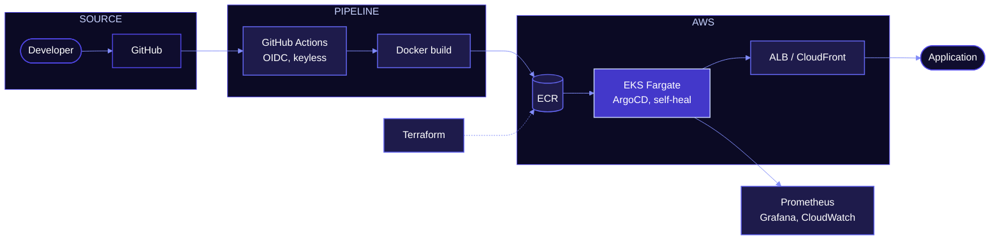
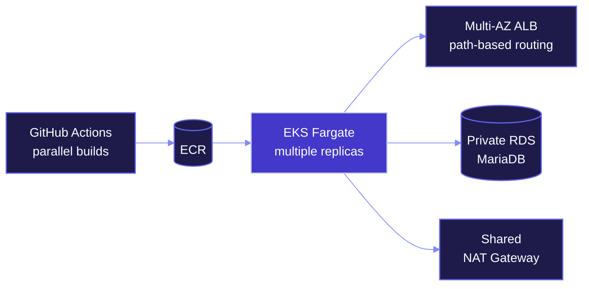
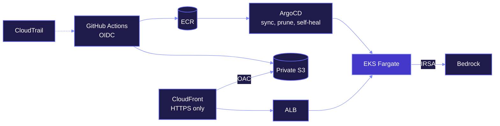
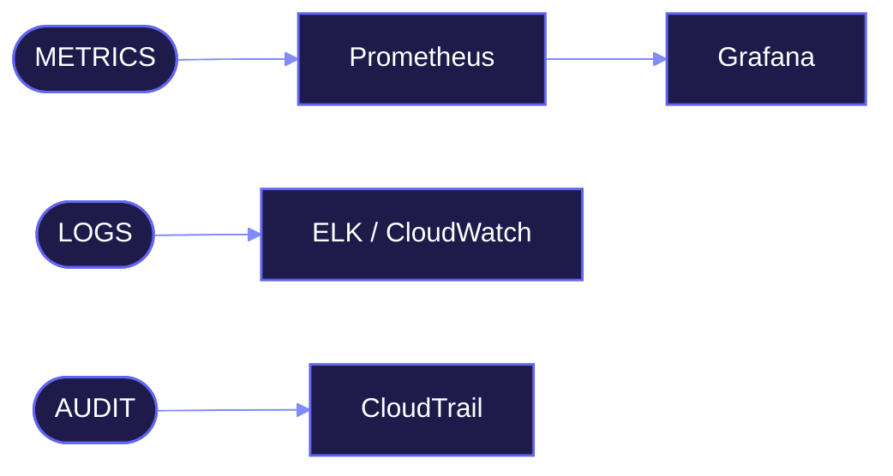

```mermaid
%%{init: {'theme':'base','themeVariables':{'fontFamily':'Inter, ui-sans-serif, system-ui, sans-serif','lineColor':'#818CF8','textColor':'#E2E8F0','edgeLabelBackground':'#1E1B4B','primaryTextColor':'#FFFFFF'}}}%%
flowchart LR
  A["OIDC"] --> B["Temporary<br/>credentials"] --> C["IRSA"] --> D["Least<br/>privilege"] --> E["Private<br/>network"] --> F["WAF"] --> G["CloudTrail"]
classDef aws fill:#1E1B4B,stroke:#6366F1,color:#FFF,stroke-width:1.5px
classDef k8s fill:#4338CA,stroke:#C7D2FE,color:#FFF,stroke-width:1.5px
classDef ci fill:#1E1B4B,stroke:#6366F1,color:#FFF,stroke-width:1.5px
classDef iac fill:#1E1B4B,stroke:#6366F1,color:#FFF,stroke-width:1.5px
classDef obs fill:#1E1B4B,stroke:#6366F1,color:#FFF,stroke-width:1.5px
classDef sec fill:#1E1B4B,stroke:#6366F1,color:#FFF,stroke-width:1.5px
classDef neu fill:#0F0D2E,stroke:#4F46E5,color:#FFF,stroke-width:1.5px
class A,B,C,D,E,F,G sec
```
 

<i>— Nitya Prakash</i>

 

### DEVOPS ENGINEER

 

 

 

 

 

<h3 align="center">
I build cloud platforms where 
deployments are repeatable, 
credentials are temporary, 
failures are observable, 
and scale is designed, not hoped for.
</h3>

 

 

<b><code>CLOUD · AWS</code></b> 
                

<b><code>CONTAINERS</code></b> 
    

<b><code>DELIVERY</code></b> 
   

<b><code>INFRASTRUCTURE</code></b> 
     

<b><code>OBSERVABILITY</code></b> 
    

<b><code>SECURITY · NETWORKING</code></b> 
         

<b><code>TOOLS</code></b> 
     

 

 

 

 

### 01 · Containerized Web Application Deployment on Amazon EKS Fargate with GitHub Actions CI/CD

> Push-to-deploy pipeline: parallel image builds, ECR push, manifest apply and rollout verification on EKS Fargate.

 

- VPC prepared for Fargate: NAT Gateway and a private pod subnet
- Private RDS MariaDB, security group scoped to the VPC CIDR
- AWS Load Balancer Controller via an IRSA role limited to one service account
- Frontend and API behind one ALB with path-based routing

          

 

### 02 · Production GitOps Delivery on Amazon EKS Fargate with CloudFront and Keyless CI/CD

> Production delivery with no long-lived AWS credentials, and a cluster that corrects its own configuration drift.

  

- Trust policy restricted to one repository and branch
- Static build synced to private S3, served through CloudFront with OAC
- ALB as the API origin, HTTPS-only access
- Least-privilege Bedrock policy for the backend pod via IRSA

           

 

### 03 · Microservices Migration from Docker Compose to Kubernetes on Amazon EKS

> Three Spring Boot microservices and a React/Vite frontend moved from a single EC2 host to EKS.

```mermaid
%%{init: {'theme':'base','themeVariables':{'fontFamily':'Inter, ui-sans-serif, system-ui, sans-serif','lineColor':'#818CF8','textColor':'#E2E8F0','edgeLabelBackground':'#1E1B4B','primaryTextColor':'#FFFFFF'}}}%%
flowchart LR
  DC["Docker Compose<br/>single EC2 host"] --> SV["Containerized<br/>services"] --> ECR[("ECR")] --> EKS["EKS<br/>manifests, HPA"] --> ALB["ALB Ingress"] --> R53["Route 53<br/>Certbot SSL"] --> PROD(["Production"])
classDef aws fill:#1E1B4B,stroke:#6366F1,color:#FFF,stroke-width:1.5px
classDef k8s fill:#4338CA,stroke:#C7D2FE,color:#FFF,stroke-width:1.5px
classDef ci fill:#1E1B4B,stroke:#6366F1,color:#FFF,stroke-width:1.5px
classDef iac fill:#1E1B4B,stroke:#6366F1,color:#FFF,stroke-width:1.5px
classDef obs fill:#1E1B4B,stroke:#6366F1,color:#FFF,stroke-width:1.5px
classDef sec fill:#1E1B4B,stroke:#6366F1,color:#FFF,stroke-width:1.5px
classDef neu fill:#0F0D2E,stroke:#4F46E5,color:#FFF,stroke-width:1.5px
class DC,SV neu
class ECR,ALB,R53 aws
class EKS k8s
class PROD iac
```

- Namespace, ConfigMap, Deployment, Service, ALB Ingress and HPA manifests
- Cluster via eksctl; Load Balancer Controller with IRSA
- NAT Gateway for a stable egress IP
- Idempotent bootstrap script that seeds organizations and users

          

 

 

<kbd>PODS STUCK IN PENDING</kbd> &nbsp;→&nbsp; Fargate scheduling configuration 
<kbd>COREDNS FAILURES</kbd> &nbsp;→&nbsp; cluster DNS on Fargate 
<kbd>IMAGEPULLBACKOFF</kbd> &nbsp;→&nbsp; missing NAT route from the private subnet 
<kbd>CRASHLOOPBACKOFF</kbd> &nbsp;→&nbsp; RDS security-group rules 
<kbd>ALB 502</kbd> &nbsp;→&nbsp; traced through target health and logs

<kbd>OIDC ACCESSDENIED</kbd> &nbsp;→&nbsp; IAM trust relationship, found in CloudTrail 
<kbd>ARGOCD CRD SIZE LIMIT</kbd> &nbsp;→&nbsp; solved with server-side apply 
<kbd>ADMISSION WEBHOOK FAILURE</kbd> &nbsp;→&nbsp; failing webhook blocking deployments 
<kbd>EKS ACCESS POLICY ERRORS</kbd> &nbsp;→&nbsp; cluster access granted explicitly 
<kbd>FARGATE PROFILE IMMUTABILITY</kbd> &nbsp;→&nbsp; profiles cannot be edited in place 
<kbd>RUNASNONROOT UID ERRORS</kbd> &nbsp;→&nbsp; container user IDs vs. the security policy

<kbd>HOSTNAME MISMATCHES</kbd> &nbsp;→&nbsp; configuration defects found during cutover

 

 

 

 

 

 

 

 

 

## Let’s talk infrastructure.

