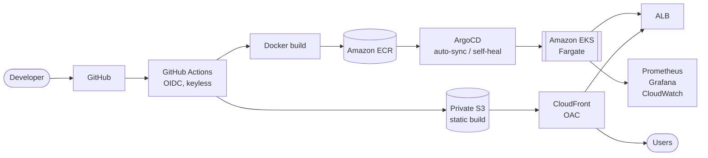
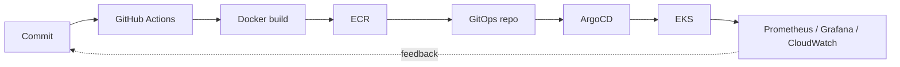
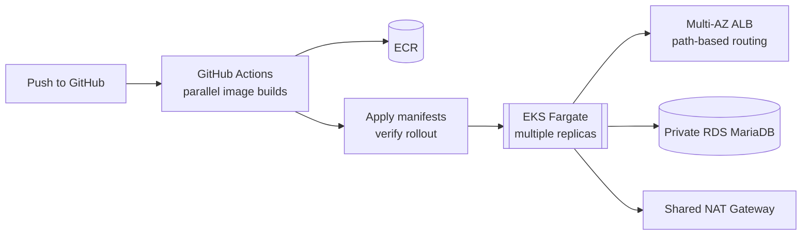
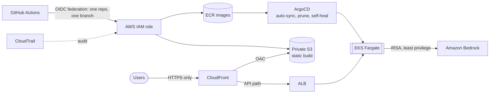
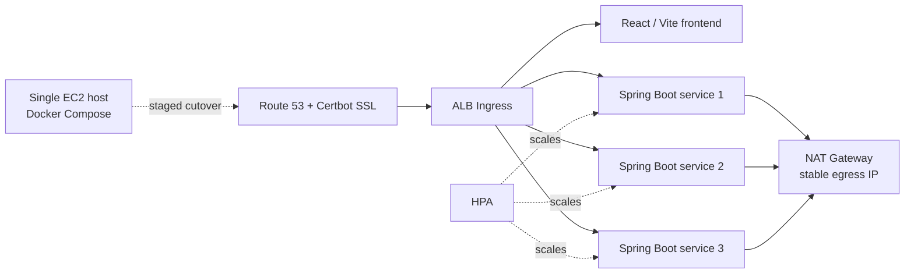
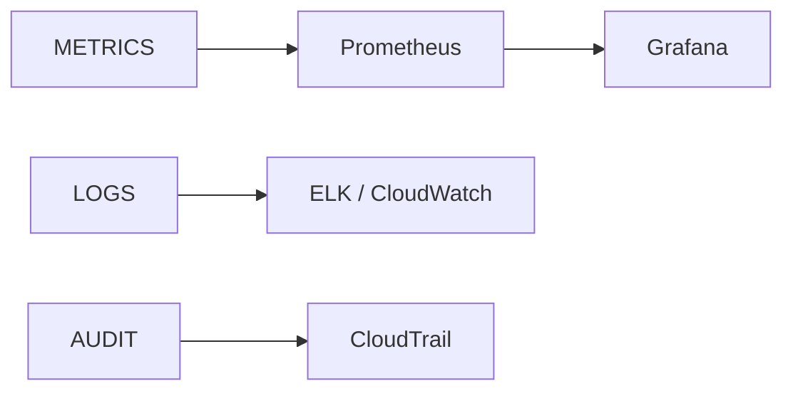

 

<code>PUNE, INDIA</code> &nbsp;·&nbsp; <code>AWS</code> &nbsp;·&nbsp; <code>EKS</code> &nbsp;·&nbsp; <code>GITOPS</code> &nbsp;·&nbsp; <code>IaC</code>

 

<table align="center" width="100%">
<tr>
<td width="50%" valign="top">

**`SYSTEM STATUS`** &nbsp; `● OPERATIONAL`

<code>CLOUD</code> &nbsp;&nbsp;&nbsp;&nbsp;&nbsp;&nbsp;&nbsp;&nbsp;&nbsp;&nbsp;&nbsp;AWS 
<code>ORCHESTRATION</code> &nbsp;EKS · Fargate · ECS 
<code>DELIVERY</code> &nbsp;&nbsp;&nbsp;&nbsp;&nbsp;&nbsp;&nbsp;GitHub Actions · ArgoCD 
<code>INFRA</code> &nbsp;&nbsp;&nbsp;&nbsp;&nbsp;&nbsp;&nbsp;&nbsp;&nbsp;Terraform · Ansible 
<code>OBSERVE</code> &nbsp;&nbsp;&nbsp;&nbsp;&nbsp;&nbsp;Prometheus · Grafana · ELK 
<code>SECURITY</code> &nbsp;&nbsp;&nbsp;&nbsp;&nbsp;IAM · OIDC · IRSA

</td>
<td width="50%" valign="top">

**`WHAT I DO`**

I design, automate, deploy, secure and troubleshoot cloud infrastructure, from the VPC up to the pipeline that ships onto it.

**`WHERE TO START`**

[Projects](#projects) · [Impact](#engineering-impact) · [Field notes](#things-ive-broken-and-fixed) · [Contact](#contact)

</td>
</tr>
</table>

 

---

## Statement

### Infrastructure should be boring on a Friday evening.

I build AWS platforms that stay up when traffic spikes, deployments go sideways, and someone fat-fingers a security group. Releases are push-to-deploy, credentials are short-lived or absent, and drift is reverted by the system rather than discovered by a person.

Most of what I know comes from the moment a diagram and reality disagree, and from fixing it.

---

## Engineering Philosophy

<table align="center" width="100%">
<tr>
<td align="center" width="20%"> <code>01</code> <b>ARCHITECT</b> Multi-AZ, private by default, no single points of failure  </td>
<td align="center" width="20%"> <code>02</code> <b>AUTOMATE</b> If it's done twice, it becomes code  </td>
<td align="center" width="20%"> <code>03</code> <b>SECURE</b> Least privilege, federated identity, audited changes  </td>
<td align="center" width="20%"> <code>04</code> <b>OBSERVE</b> Metrics, logs and audit trails before the incident  </td>
<td align="center" width="20%"> <code>05</code> <b>OPTIMIZE</b> Right-size compute, cache at the edge, share what can be shared  </td>
</tr>
</table>

<code>RELIABILITY</code> · <code>REPRODUCIBILITY</code> · <code>SECURITY</code> · <code>OBSERVABILITY</code> · <code>SCALABILITY</code> · <code>COST EFFICIENCY</code>

---

## Stack

<table width="100%">
<tr>
<td width="22%" valign="top"><b><code>CLOUD</code></b></td>
<td><code>EC2</code> <code>VPC</code> <code>IAM</code> <code>S3</code> <code>RDS</code> <code>EFS</code> <code>Route 53</code> <code>CloudFront</code> <code>Lambda</code> <code>API Gateway</code> <code>ALB</code> <code>Auto Scaling</code> <code>Service Quotas</code> <code>Bedrock</code></td>
</tr>
<tr>
<td valign="top"><b><code>CONTAINERS</code></b></td>
<td><code>Docker</code> <code>Kubernetes</code> <code>EKS</code> <code>ECS</code> <code>Fargate</code> <code>ECR</code> <code>Helm</code> <code>Ingress</code> <code>HPA</code></td>
</tr>
<tr>
<td valign="top"><b><code>INFRASTRUCTURE</code></b></td>
<td><code>Terraform</code> <code>Ansible</code> <code>AWS CLI</code> <code>eksctl</code> <code>boto3</code></td>
</tr>
<tr>
<td valign="top"><b><code>CI/CD</code></b></td>
<td><code>GitHub Actions</code> <code>Jenkins</code> <code>CircleCI</code></td>
</tr>
<tr>
<td valign="top"><b><code>GITOPS</code></b></td>
<td><code>ArgoCD</code></td>
</tr>
<tr>
<td valign="top"><b><code>OBSERVABILITY</code></b></td>
<td><code>Prometheus</code> <code>Grafana</code> <code>ELK</code> <code>CloudWatch</code> <code>CloudTrail</code></td>
</tr>
<tr>
<td valign="top"><b><code>SECURITY</code></b></td>
<td><code>IAM</code> <code>OIDC</code> <code>IRSA</code> <code>AWS WAF</code> <code>Cloudflare</code> <code>TLS</code> <code>Security Groups</code> <code>Private Subnets</code></td>
</tr>
<tr>
<td valign="top"><b><code>LANGUAGES</code></b></td>
<td><code>Python</code> <code>Bash</code> &nbsp;·&nbsp; <code>Linux</code> <code>Nginx</code> <code>Git</code> <code>Certbot</code></td>
</tr>
</table>

---

## Architecture Map

How my delivery path and platform pieces connect.

<table width="100%">
<tr>
<td width="25%" valign="top"><b><code>TERRAFORM</code></b> Declarative AWS infrastructure</td>
<td width="25%" valign="top"><b><code>ARGOCD</code></b> Git as the source of truth for the cluster</td>
<td width="25%" valign="top"><b><code>PROMETHEUS · GRAFANA</code></b> Metrics and dashboards</td>
<td width="25%" valign="top"><b><code>IAM · OIDC · IRSA</code></b> Identity without static keys</td>
</tr>
</table>

### Delivery timeline

<code>IDEA</code> → <code>CODE</code> → <code>BUILD</code> → <code>SHIP</code> → <code>RUN</code> → <code>OBSERVE</code> → <code>IMPROVE</code>

---

## Projects

Three case studies. Open each one for the build, the failures, and the fixes.

 

### `CASE 01` &nbsp; Push-to-Deploy on EKS Fargate

> **Objective:** replace manual deployments with a pipeline that builds, ships and verifies on every push.

<code>EKS</code> <code>Fargate</code> <code>ECR</code> <code>ALB Ingress</code> <code>RDS MariaDB</code> <code>VPC</code> <code>NAT Gateway</code> <code>IRSA</code> <code>Docker</code> <code>GitHub Actions</code> <code>Helm</code>

<b>Open the case study: Containerized Web Application Deployment on Amazon EKS Fargate with GitHub Actions CI/CD</b>

 

<table width="100%">
<tr>
<td width="33%" valign="top">

**`BUILT`**

- Push-to-deploy workflow: parallel image builds, ECR push, manifest apply, rollout verification
- VPC prepared for Fargate with a NAT Gateway and a private pod subnet
- Private RDS MariaDB, security group scoped to the VPC CIDR
- AWS Load Balancer Controller with an IRSA role limited to one service account
- Frontend and API behind one multi-AZ ALB with path-based routing

</td>
<td width="33%" valign="top">

**`BROKE, THEN FIXED`**

- CoreDNS issues
- Fargate pods stuck in `Pending`
- `ImagePullBackOff` from a missing NAT route
- Backend `CrashLoopBackOff` from RDS security group rules
- ALB `502`, traced through target health and logs

</td>
<td width="33%" valign="top">

**`OUTCOME`**

~80% less manual deployment effort

~50% lower networking cost for non-production traffic, via one shared NAT Gateway

</td>
</tr>
</table>

 

### `CASE 02` &nbsp; Keyless GitOps Delivery with CloudFront

> **Objective:** ship to production with zero stored AWS credentials and a cluster that heals its own drift.

<code>EKS</code> <code>Fargate</code> <code>ECR</code> <code>S3</code> <code>CloudFront</code> <code>ALB</code> <code>ArgoCD</code> <code>GitHub Actions OIDC</code> <code>IRSA</code> <code>CloudTrail</code> <code>Bedrock</code> <code>Python</code>

<b>Open the case study: Production GitOps Delivery on Amazon EKS Fargate with CloudFront and Keyless CI/CD</b>

 

<table width="100%">
<tr>
<td width="33%" valign="top">

**`BUILT`**

- GitHub Actions federates into AWS via OIDC, trust policy restricted to one repository and branch
- Images pushed to ECR; static build synced to private S3
- ArgoCD with auto-sync, prune and self-heal; configuration drift reverts automatically
- IRSA with a least-privilege Bedrock policy for the backend pod
- CloudFront with a private S3 origin (Origin Access Control), ALB as the API origin, HTTPS-only

</td>
<td width="33%" valign="top">

**`BROKE, THEN FIXED`**

- OIDC `AccessDenied`, diagnosed through CloudTrail
- Fargate profile immutability
- `runAsNonRoot` UID errors
- ArgoCD CRD size limits, solved with server-side apply
- A failing admission webhook
- EKS access policy errors

</td>
<td width="33%" valign="top">

**`OUTCOME`**

100% of long-lived AWS credentials eliminated

~85% less manual release effort

~30% lower compute spend via Fargate sizing and edge caching

</td>
</tr>
</table>

 

### `CASE 03` &nbsp; Docker Compose to Kubernetes

> **Objective:** move a multi-service application off a single EC2 host without breaking the cutover.

<code>EKS</code> <code>eksctl</code> <code>ECR</code> <code>Kubernetes</code> <code>ALB Ingress</code> <code>IRSA</code> <code>HPA</code> <code>NAT Gateway</code> <code>Route 53</code> <code>Certbot</code> <code>Docker</code>

<b>Open the case study: Microservices Migration from Docker Compose to Kubernetes on Amazon EKS</b>

 

<table width="100%">
<tr>
<td width="50%" valign="top">

**`BUILT`**

- Three Spring Boot microservices and a React/Vite frontend moved to EKS
- Namespace, ConfigMap, Deployment, Service, ALB Ingress and HPA manifests
- Cluster provisioned with `eksctl`; images published to ECR
- Load Balancer Controller installed with IRSA
- Outbound traffic via NAT Gateway for a stable egress IP
- Idempotent bootstrap script that seeds organizations and users

</td>
<td width="50%" valign="top">

**`THE CUTOVER`**

Rolled out in stages from the EC2 host to EKS, with Route 53 for DNS and Certbot for SSL. Configuration defects and hostname mismatches surfaced during the switch and were fixed along the way.

**`OUTCOME`**

~70% less environment setup effort

</td>
</tr>
</table>

---

## Engineering Impact

<table align="center" width="100%">
<tr>
<td align="center" width="33%"> <h1>80%</h1>less manual deployment effort  </td>
<td align="center" width="33%"> <h1>85%</h1>less manual release effort  </td>
<td align="center" width="33%"> <h1>100%</h1>long-lived AWS credentials eliminated  </td>
</tr>
<tr>
<td align="center"> <h1>50%</h1>networking cost reduction for selected non-production traffic  </td>
<td align="center"> <h1>30%</h1>compute spend reduction via sizing and edge caching  </td>
<td align="center"> <h1>70%</h1>less environment setup effort  </td>
</tr>
</table>

Figures are approximate and come from the case studies above.

---

## Things I've Broken and Fixed

<i>Production doesn't care about your YAML.</i>

 

<table width="100%">
<tr>
<th align="left">SYMPTOM</th>
<th align="left">WHERE REALITY DISAGREED</th>
</tr>
<tr><td><code>CoreDNS failing</code></td><td>Cluster DNS on Fargate needed attention before anything could resolve</td></tr>
<tr><td><code>Pods stuck in Pending</code></td><td>Fargate scheduling and profile behavior</td></tr>
<tr><td><code>ImagePullBackOff</code></td><td>The private subnet had no NAT route</td></tr>
<tr><td><code>CrashLoopBackOff</code></td><td>RDS security group rules blocked the backend</td></tr>
<tr><td><code>ALB 502</code></td><td>Found through target health and logs</td></tr>
<tr><td><code>OIDC AccessDenied</code></td><td>Traced in CloudTrail</td></tr>
<tr><td><code>ArgoCD CRD too large</code></td><td>Solved with server-side apply</td></tr>
<tr><td><code>Admission webhook failures</code></td><td>A failing webhook blocked deployments</td></tr>
<tr><td><code>EKS access policy errors</code></td><td>Cluster access had to be granted explicitly</td></tr>
<tr><td><code>Fargate profile immutability</code></td><td>Profiles can't be edited in place, so the approach had to adapt</td></tr>
<tr><td><code>runAsNonRoot UID errors</code></td><td>Container user IDs didn't satisfy the policy</td></tr>
</table>

 

I don't just deploy infrastructure. I debug it when the architecture diagram turns out to be a suggestion.

---

## Security as a Design Constraint

<table width="100%">
<tr>
<td width="33%" valign="top">

**`IDENTITY`**

IAM least privilege 
OIDC federation for CI/CD 
IRSA scoped to one service account 
No long-lived pipeline credentials

</td>
<td width="33%" valign="top">

**`NETWORK`**

Private subnets 
Private databases 
Restricted security groups 
Private S3 behind CloudFront OAC

</td>
<td width="33%" valign="top">

**`EDGE & AUDIT`**

AWS WAF · Cloudflare WAF 
HTTPS only 
CloudTrail for change tracking

</td>
</tr>
</table>

---

## Observability

Metrics tell me something is wrong. Logs tell me where. Audit trails tell me who changed it.

---

## Currently Exploring

<code>Platform Engineering</code> &nbsp; <code>Kubernetes</code> &nbsp; <code>AWS</code> &nbsp; <code>GitOps</code> &nbsp; <code>Cloud Security</code> &nbsp; <code>Infrastructure as Code</code>

<code>AI / GenAI Infrastructure</code> &nbsp; <code>Amazon Bedrock</code> &nbsp; <code>DevOps Automation</code> &nbsp; <code>Observability</code> &nbsp; <code>Cost Optimization</code> &nbsp; <code>Production Reliability</code>

---

## GitHub Activity

&nbsp;

---

 

· · ·

  

### *"Do you understand the violence it took to become this gentle?"*

 

— Nitya Prakash

  

· · ·

 

---

## Contact

### Let's build something that survives production.

 

